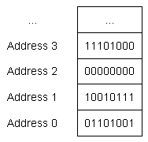
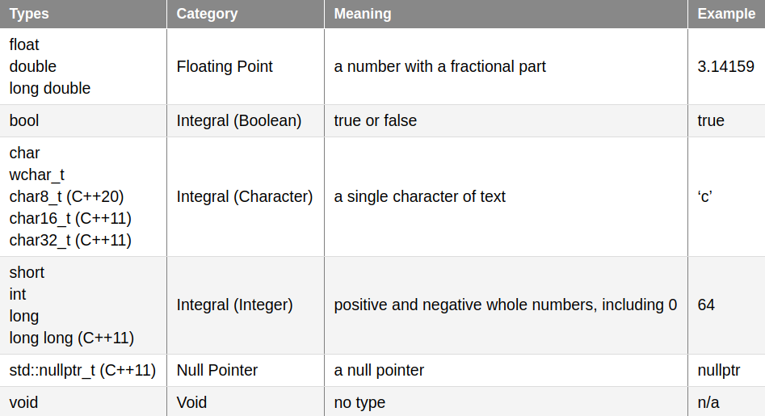

# [4.1 - Introduction to Fundamental Data Types](https://www.learncpp.com/cpp-tutorial/introduction-to-fundamental-data-types/)

## Bits, Bytes, and Memory Addressing
The smallest unit of memory = 1 binary digit (bit)

1 byte = 8 bit

Each byte has a unique memory address (not each bit).



## Data Types
A **data type** tells the compiler how to interpret the contents of memory (bits) in a meaningful way. The compiler and CPU take care of encoding the value into the appropriate sequence of bits for that data type.

For example, when we declare a variable as an integer, we are telling the compiler "the piece of memory that this variable uses is going to be interpreted as an integer value." So `65` may be converted to the sequence of bits `01000001`, and when evaluated to produce a value it's converted back to `65`.

## Fundamental Data Types
fundamental data types = basic types = primitive types = built-in types



# [4.2 - Void](https://www.learncpp.com/cpp-tutorial/void/)
**Void** means *no type*.

Void variables cannot be defined with a type of void.

```cpp
void value; // won't work
```

## Functions that do not return a value
Most commonly, *void* is used to indicate that a function does not return a value:
```cpp
void writeValue(int x) // void here means no return value
{
    std::cout << "The value of x is: " << x << '\n';
    // no return statement because this function doesn't return a value
}
```

## Deprecated: Functions that do not take parameters
This is what you'd do in C to indicate that a function doesn't take parameters:
```c
int getValue(void) // void here means no parameters
{
    int x;
    std::cin >> x;
    return x;
}
```
This will compile in C++ (for backwards compatibility reasons), but this use of *void* is considered deprecated in C++. This following code is equivalent and preferred in C++:
```cpp
int getValue() // empty function parameters is an implicit void
{
    int x;
    std::cin >> x;
    return x;
}
```

## Other Uses of Void
There is a third, more advanced use that will be covered later: [9.20 - Void Pointers](https://www.learncpp.com/cpp-tutorial/void-pointers/).
