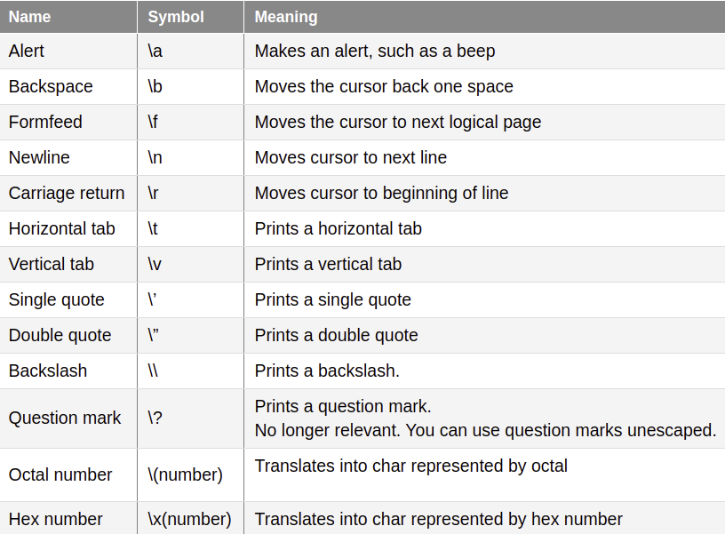
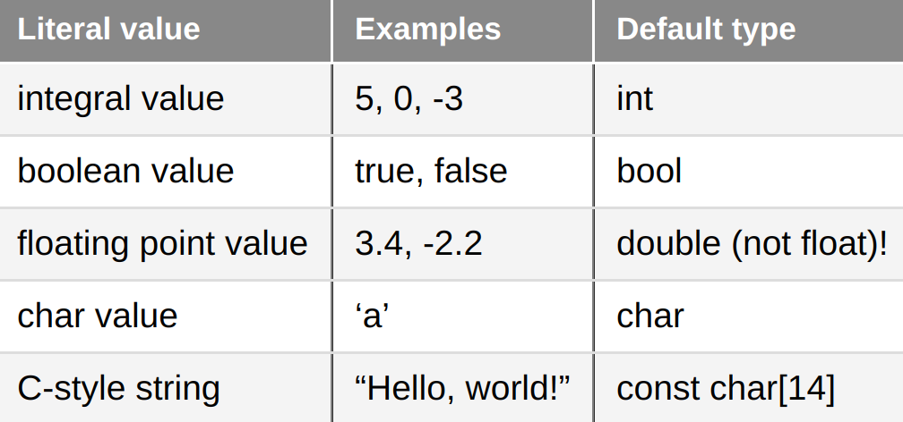
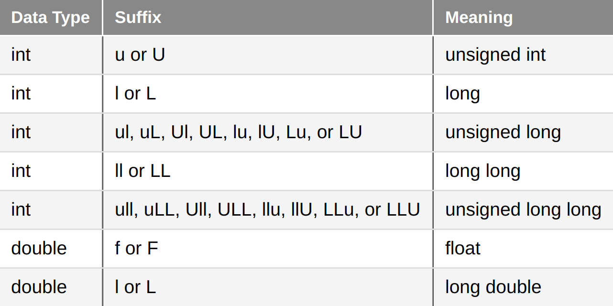
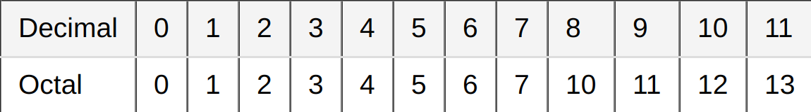
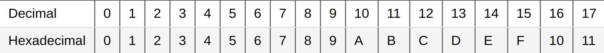

# [4.1 - Introduction to Fundamental Data Types](https://www.learncpp.com/cpp-tutorial/introduction-to-fundamental-data-types/)

## Bits, Bytes, and Memory Addressing
The smallest unit of memory = 1 binary digit (bit)

1 byte = 8 bit

Each byte has a unique memory address (not each bit).


## Data Types
A **data type** tells the compiler how to interpret the contents of memory (bits) in a meaningful way. The compiler and CPU take care of encoding the value into the appropriate sequence of bits for that data type.

For example, when we declare a variable as an integer, we are telling the compiler "the piece of memory that this variable uses is going to be interpreted as an integer value." So `65` may be converted to the sequence of bits `01000001`, and when evaluated to produce a value it's converted back to `65`.

## Fundamental Data Types
fundamental data types = basic types = primitive types = built-in types


# [4.2 - Void](https://www.learncpp.com/cpp-tutorial/void/)
**Void** means *no type*.

Void variables cannot be defined with a type of void.

```cpp
void value; // won't work
```

## Functions that do not return a value
Most commonly, *void* is used to indicate that a function does not return a value:
```cpp
void writeValue(int x) // void here means no return value
{
    std::cout << "The value of x is: " << x << '\n';
    // no return statement because this function doesn't return a value
}
```

## Deprecated: Functions that do not take parameters
This is what you'd do in C to indicate that a function doesn't take parameters:
```c
int getValue(void) // void here means no parameters
{
    int x;
    std::cin >> x;
    return x;
}
```
This will compile in C++ (for backwards compatibility reasons), but this use of *void* is considered deprecated in C++. This following code is equivalent and preferred in C++:
```cpp
int getValue() // empty function parameters is an implicit void
{
    int x;
    std::cin >> x;
    return x;
}
```

## Other Uses of Void
There is a third, more advanced use that will be covered later: [9.20 - Void Pointers](https://www.learncpp.com/cpp-tutorial/void-pointers/).


# [4.3 - Object Sizes and the sizeof Operator](https://www.learncpp.com/cpp-tutorial/object-sizes-and-the-sizeof-operator/)
A single object of variable name *x* may occupy multiple consecutive memory addresses depending on its type.

**Key insight:** focus on writing maintainable code, and optimize only when and where the difference will be substantive.

## Fundamental Data Type Sizes
C++ only guarantees that each fundamental data type is a *minimum* size; the actual size of the variables is compiler and/or computer architecture-dependent. 

**Best practice:** for maximum compatibility, don't assume that the variables are longer than the specified minimum size.

## The sizeof operator
The **sizeof** operator is a unary operator that takes either a type or variable and returns its size in bytes. For example,

```cpp
#include <iostream>
 
int main()
{
    std::cout << "bool:\t\t" << sizeof(bool) << " bytes\n";
    std::cout << "char:\t\t" << sizeof(char) << " bytes\n";
    std::cout << "long double:\t" << sizeof(long double) << " bytes\n";
    int x = 3;
    std::cout << "int x:\t\t" << sizeof(x) << " bytes\n";
 
    return 0;
}
```

**As an aside...** CPUs are often optimized to process data of a certain size (e.g. 32 bits), and types that match that size may be processed quicker. On such a machine, a 32-bit *int* could be faster than a 16-bit *short* or an 8-bit *char*.

# [4.4 - Signed Integers](https://www.learncpp.com/cpp-tutorial/signed-integers/)


The preferred way to define the four types of signed integers:
```cpp
short s;
int i;
long l;
long long ll;
```

You can also add an optional *int* suffix or *signed* prefix, but this is not best practice because integers are *signed* by default and the *int* suffix is confusing:
```cpp
short int si;
long int li;
long long int lli;

signed short ss;
signed int si;
signed long sl;
signed long long sll;
```

## Signed Integer Ranges
The integers types can hold values within the following ranges


## Integer Overflow
**Integer overflow** occurs when we try to store a value that is outside the range of the type. 

**Warning:** in the case of signed integers, which bits are lost is not well defined. Thus, signed integer overflow leads to undefined behavior.

## Integer Division
**When dividing with integers, C++ produces an integer result. Any fractional portion is dropped, not rounded!**

```cpp
#include <iostream>

int main()
{
    std::cout << 8 / 5; // = 1

    return 0;
}
```

# [4.5 - Unsigned Integers and Why to Avoid Them](https://www.learncpp.com/cpp-tutorial/unsigned-integers-and-why-to-avoid-them/)
**Unsigned integers** are integers that can hold only non-negative whole numbers.

## Defining Unsigned Integers
To define an unsigned integer, use the *unsigned* keyword:
```cpp
unsigned short us;
unsigned int ui;
unsigned long ul;
unsigned long long ull;
```

## Unsigned Integer Range


## Unsigned Integer Overflow
Unsigned integer overflow wraps around the values. For example, for a 1 byte unsigned int, the number 255 is held as is, the number 256 wraps back around and is stored as 0, 257 is stored as 1, 280 is stored as 24, and so on.

Negative numbers wrap back around, so -1 wraps to 255, -2 to 254, and so on. This is true for the others sizes/types.

## Warning
Avoid using unsigned numbers except in some cases or when unavoidable. It can lead to undefined behavior, or be confusing when mixing signed and unsigned integers in math (all integers are automatically treated as unsigned integers when mixed in mathematical expressions, so mix them carefully or not at all). 

Sometimes you still need unsigned numbers, and it's more common in embedded systems (e.g. Arduinos).

# [4.6 - Fixed-width Integers and size_t](https://www.learncpp.com/cpp-tutorial/fixed-width-integers-and-size-t/)
C++ only guarantees that integers have a minimum size, meaning that ranges are not fixed. The rationale for this goes back to C - computers were slow and perormance was of utmost concern, so it was left to compiler implementors to pick the best size for each type on the target computer architecture. But this sucks by modern standards.

To help with cross-compatibility and headaches, C99 defined a set of **fixed-width integers** that are guaranteed to have the same size on any architecture:


These can be accessed by including the *cstdint* header, where they are defined in the *std* namespace. For example,

```cpp
#include <cstdint>
#include <iostream>

int main()
{
    std::int16_t i{5};
    std::cout << i;
    return 0;
}
```

**Warning:** these too should be avoided for reasons of performance and wide compatibility. Also because std::int8_t and std::uint8_t are often treated and behave like chars.

## Fast and Least Integers
The fast type (std::int_fast#_t) provides the fastest signed integer type with a width of at least # bits.

The least type (std::int_least#_t) provides the smallest signed integer type with a width of at least # bits.

`# = 8, 16, 32, 64`

**Best practice:** use the std::fast#_t and std::int_least#_t when you need an integer guaranteed to be at least a certain minimum size.

## Integer Best Practices
- *int* should be preferred when size doesn't matter (e.g. the number value will always fit within the range of a 2 byte signed integer).
- If you need a variable guaranteed to be a particular size and want to favor performance (no lost data), use std::int_fast#_t
- If you need a variable guaranteed to be a particular size and want to favor memory conservation over performance, use std::int_least#_t. 

Avoid the following when possible:
- Unsigned types
- the 8-bit fixed-width integer types
- Compiler-specific fixed-width integers

## What is std::size_t?
**std::size_t** is defined as an unsigned integral type and is typically used to represent the size or length of objects. It is its own type.

*size_t* is defined to be big enough to hold the size of the largest object creatable on your system (in bytes). For a 32-bit system, that's 4 bytes. For a 64-bit system, that's 8 bytes.

# [4.7 - Introduction to Scientific Notation](https://www.learncpp.com/cpp-tutorial/introduction-to-scientific-notation/)

When converting numbers to scientific notation, don't trim trailing zeros in the significand because they indicate the accuracy of the number - they are significant digits.

# [4.8 - Floating Point Numbers](https://www.learncpp.com/cpp-tutorial/floating-point-numbers/)
The *floating*  in *floating point* refers to the fact that the decimal point can float; i.e. it can support a variable number of digits before and after the decimal point.

There are 3 different floating point types: **float, long, double**


Here is what the declarations look like
```cpp
float fValue;
double dValue;
long double ldValue;
```

Here are some examples of definitions using literals
```cpp
int x{5}; // 5 means integer
double y{5.0}; // 5.0 is a floating point literal (no suffix means double type by default)
float z{5.0f}; // 5.0 is a floating point literal, f suffix means float type
```

**Note:** by default, floating point literals default to double type. Use an f suffix to indicate float type.

**Best practice:** make sure your literals match the type of variable they're being assigned to. Otherwise an unnecessary conversion will result, and possibly a loss of precision.

**Warning:** don't use integer literals where floating point literals should be used, including when initializing or assigning values to floating point objects, foing floating point arithmetic, and calling functions that expect floating point values.

## Printing Floating Point Numbers

The program:
```cpp
#include <iostream>

int main()
{
    std::cout << 5.0 << '\n';
    std::cout << 6.7f << '\n';
    std::cout << 9876543.21 << '\n';
}
```

will print
```
5
6.7
9.87654e+06
```

std::cout will not print the fractional part of a number if it's zero. std::cout defaults to 6 digits. We can set the precision of std::cout using an **output manipulator** function named `std::set_precision()` from the `<iomanip>` header.
```cpp
#include <iostream>
#include <iomanip>

int main()
{
    std::cout << std::setprecision(16); // show 16 digits of precision
    std::cout << 3.3333333333333333333f << '\n'; // float
    std::cout << 3.3333333333333333333 << '\n'; // double
}
```

Outputs:

3.333333253860474
3.333333333333334

Setting the precision of std::cout lower than required will result in a rounding error. For example,
```cpp
#include <iostream>
#include <iomanip>

int main()
{
    float f {123456789.0f};
    std::cout << std::setprecision(9);
    std::cout << f << '\n';
    return 0;
}

```
outputs:

123456792


## Floating Point Range


## Floating Point Precision
The **precision** of a floating point number defines how many *significant digits* it can represent without information loss.

**Best practice:** favor a double over a float unless space is at a premium, as the lack of precision in a float will cause inaccuracies.

## Rounding Errors Make Floating Point Comparisons Tricky
Non-obvious differences between decimals (how we think) and binary numbers (how these numbers are stored) make comparisons tricky and rounding errors common. for example, the number 0.1 is stored as the infinite sequence 0.00011001100110011..., so when we set it to a float we get precision problems as rounding errors. For example,

```cpp
#include <iostream>
#include <iomanip>

int main()
{
    double d{0.1};
    std::cout << d << '\n';
    std::cout << std::setprecision(17);
    std::cout << d << '\n';

    return 0;
}
```

this outputs:
```
0.1
0.10000000000000001
```
It's not *exactly* 0.1.

Another interesting example: adding 0.1 ten times does not get exactly 1.0
```cpp
#include <iomanip> // for std::setprecision()
#include <iostream>
 
int main()
{
    std::cout << std::setprecision(17);
 
    double d1{ 1.0 };
    std::cout << d1 << '\n';
	
    double d2{ 0.1 + 0.1 + 0.1 + 0.1 + 0.1 + 0.1 + 0.1 + 0.1 + 0.1 + 0.1 }; // should equal 1.0
    std::cout << d2 << '\n';
}
```

```
1
0.99999999999999989
```

Note that addition or multiplication tend to make rounding errors grow.

**Key insight:** rounding errors happen when a number can't be stored precisely. This happens all the time, therefore this is the rule, not the exception. Never assume floating point numbers are exact, and never use floating point numbers for financial or currency data!!!

## NaN and Inf
**Inf** := Infinity

**NaN** := Not a Number

**IND** := Indeterminate

## Section Conclusion
1. Floating point numbers are useful for storing very large or very small numbers.

2. Floating point numbers often have small rounding errors, even when the number has fewer significant digits than the precision. Many times these errors go unnoticed because they are small, and because the numbers are truncated for output. However, performing comparisons of these numbers will may not give the expected results, and adding/multiplying will exacerbate these errors.

# [4.9 - Boolean Values](https://www.learncpp.com/cpp-tutorial/boolean-values/)
## Boolean Variables
Can be initialized in the following ways
```cpp
bool b; // declaration
bool b1 { true };
bool b2 { false};
b1 = false;
bool b3 {}; // default initialize to false, or zero

bool b4{ !true }; // initialized with the value false
bool b5{ !false }; // initialized with the value true
```

Booleans are stored as 0 (false) or 1 (true). Because they are stored as 0/1, they are an integral type.

## Printing Boolean Types
```cpp
#include <iostream>

int main()
{
    std::cout << true << '\n';
    std::cout << !true << '\n';

    bool b{false};
    std::cout << b << '\n';
    std::cout << !b << '\n';

    return 0;
}
```

outputs:
```
1
0
0
1
```

To have std::cout print "true" or "false", use *std::boolalpha* to turn on the feature and *std::noboolalpha* to turn it off.
```cpp
#include <iostream>

int main()
{
    std::cout << true << '\n';
    std::cout << false << '\n';

    std::cout << std::boolalpha;

    std::cout << true << '\n';
    std::cout << false << '\n';

    std::cout << std::noboolalpha; // turn it off to go back to printing 0/1

    std::cout << true << '\n';
    std::cout << false << '\n';

    return 0;
}
```

output:
```
1
0
true
false
1
0
```

## Integer to Boolean Conversion
You can't do list initialization of a boolean with an integer, but you can do direct and copy list initialization, and a narrowing conversion will result. For example,
```cpp
#include <iostream>

int main()
{
    bool b{4}; // ERROR: narrowing conversions disallowed in list initialization
    
    // copy initialization allows the implicit conversion from int to bool
    bool b1 = 4; // ALLOWED, copy initialization, the value is true
    bool b2 = 0; // ALLOWED, copy initialization, the value is false

    return 0;
}
```

## Inputting Boolean Values
By default, when inputting boolean values via std::cin, you have to use 0/1. If you'd like to input them via std::cin using "true" or "false", use std::boolalpha. When std::boolalpha is enabled, the values 0/1 will no longer be no longer be treated as booleans. For example,

```cpp
#include <iostream>

int main()
{
    bool b2{};
    std::cout << "Enter a boolean value 0/1: ";
    std::cin >> b2;
    std::cout << "You entered: " << b2 << '\n';

    std::cin >> std::boolalpha;
    std::cout << std::boolalpha;

    bool b3{};
    std::cout << "Enter another boolean value true/false: ";
    std::cin >> b3;
    std::cout << "You entered: " << b3 << '\n';

    return 0;
}
```

## Boolean Return Values
Boolean values are often used as the return type for functions that check whether something is equal or not. These functions often start with the word *is* (e.g. isEqual) or *has* (e.g. hasCommonDenominator). For example,

```cpp
bool isEqual(int x, int y)
{
    return (x==y);
}
```

# [4.10 - Introduction to If Statements](https://www.learncpp.com/cpp-tutorial/introduction-to-if-statements/)
If statements have the following structure:
```cpp
if (condition)
    true_statement;
```

If `condition` evaluates to true, then `true_statement` is executed. 

**Warning:** if statements only conditionally execute a single statement. In order to conditionally execute multiple statements, see lesson [7.2 - If statements and blocks](https://www.learncpp.com/cpp-tutorial/if-statements-and-blocks/)

## If Else
An **if else** statement looks like this:
```cpp
if (x==0)
    std::cout << "x equals zero\n";
else
    std::cout << "x is not equal to zero\n";
```

## Chaining If Statements
You can chain if statements like so:
```cpp
if (x>0)
    std::cout << "x is greater than zero\n";
else if (x<0)
    std::cout << "x is less than zero\n";
else
    std::cout << "x is equal to zero\n";
```

## Boolean Return Values and If Statements
The following program uses the boolean functionality above:
```cpp
#include <iostream>

bool isEqual(int x, int y)
{
    return (x==y);
}

int main()
{
    int x{};
    std::cout << "Enter an integer: ";
    std::cin >> x;

    int y{};
    std::cout << "Enter another integer: ";
    std::cin >> y;

    if (isEqual(x,y))
        std::cout << x << " and " << y << " are equal.\n";
    else
        std::cout << x << " and " << y << " are NOT equal.\n";
    
    return 0;
}
```

## Non-Boolean Conditionals
Non-Boolean conditionals get converted to Boolean values: non-zero values get converted to *true*, and zero gets converted to *false*. For example,

```cpp
if (4)
    std::cout << "Hi.\n";
else
    std::cout << "Bye.\n";
```

Output:
```
Hi
```

# [4.11 - Chars](https://www.learncpp.com/cpp-tutorial/chars/)
The **char** data type was designed to hold characters (a single letter, number, or whitespace). The char data type is an integral type, meaning the underlying value is stored as an integer. More specifically, the char data type is stored as an ASCII character, or a number from 0 to 127 that maps to a character in the English language.

## Initializing chars
You can initialize with character literals 
```cpp
char ch1{'a'};
```
or integers corresponding to the ASCII code, but you should avoid this
```cpp
char ch2{5}; // stored as integer 5 corresponding to ENQ
```
because it could be confused for this
```cpp
char ch3{'5'}; // stored as integer 53 corresponding to 5
```

**Warning:** don't initialize with integers.

## Printing chars
When using std::cout to print a char, std::cout outputs the variable as an ASCII character. For example,
```cpp
char ch{'a'};
std::cout << ch;

char ch2{'b'};
std::cout << ch2;
```
output:
```
ab
```

## Printing chars as integers via type casting
See section [6.6 - Explicit type conversion (casting) and static_cast](https://www.learncpp.com/cpp-tutorial/explicit-type-conversion-casting-and-static-cast/) for more on type casting, but you can do the following to print a char as the integer value it's stored as. For example, 
```cpp
char ch{'a'};
std::cout << static_cast<int>(ch) <<'\n';
```
output: 
```
97
```

This followws the format
```cpp
static_cast<new_type>(expression)
```
which takes `expression` as input and converts it to `new_type`. 

## Inputting chars
You can input a character via std::cin. For example,
```cpp
std::cout "Input a keyboard character: ";

char ch{};
std::cin >> ch;
std::cout << ch << " has ASCII code " << static_cast<int>(ch) << '\n';
```

Note that if the user inputs more than one character, char can only hold one character so the subsequent characters will remain in the input buffer/queue that std::cin uses and can be extracted with subsequent calls to std::cin.

## Escape sequences
Here is a table of escape sequences, of which `'\n'` is the most common


## Single vs Double Quotes
Stand-alone chars can only hold one character, and are placed in single quotes (e.g. 't' or '\n'). *Strings* are a collection of sequential characters and placed in double quotes (e.g. "this is a string"). 

**Rule:** put stand-alone chars (e.g. 'g' or '\n') in single quotes, not double quotes (e.g. not "g" or "\n") to help the compiler optimize.

# [4.12 - An Introduction to std::string](https://www.learncpp.com/cpp-tutorial/an-introduction-to-stdstring/)
Strings are not a fundamental type in C++, but instead a compound type. They should be put in double quotes (e.g. "this is a string").

## std::string
To using strings, we need to first include the string header

```cpp
#include <string>

std::string myName{}; // empty string

std::string yourName{"John"};

std::cout << "your name is " << yourName << '\n';
```

## String input with std::cin
std::cin breaks at whitespaces, so you have to be careful (or avoid) using it to input strings. For example, asking a user to input first and last name
```cpp
std::cout << "Enter your first and last name: ";
std::string name{};
std::cin >> name;

std::cout << "Enter your age: ";
std::string age{};
std::cin >> age;
```
Assuming the user input 
```
Enter your first and last name: John Doe
Enter your age: 45
```
Would save `name` as `John` and `age` as `Doe`. Instead, use std::getline().

## Use std::getline() to input text
To read a full line of input into a string, use std::getline()

```cpp
#include <string>
#include <iostream>
#include <iomanip> // for std::ws

int main()
{
    std::cout << "Enter your full name: ";
    std::string name{};
    std::getline(std::cin >> std::ws, name); // read a full line of text into name

    std::cout << "Enter your age: ";
    std::string age{};
    std::getline(std::cin >> std::ws, age);

    std::cout << "Your name is " << name << " and your age is " << age << '\n';

    return 0;
}
```

## What the heck is std::ws?
**Best practice:** Use the std::ws input manipulator with std::getline() to ignore leading whitespaces and properly read lines of input.

**Key Insight:** Using the extraction operator (>>) with std::cin ignores leading whitespace. std::getline() does not ignore leading whitespace unless you use the input manipulator std::ws.

## String Length
To get a string's length, call its member function as below
```cpp
#include <iostream>
#include <string>

int main()
{
    std::string myName("Alonzo");
    std::cout << "Your name has " << myName.length() << " characters.\n";
    return 0;
}
```

# [4.13 - Literals](https://www.learncpp.com/cpp-tutorial/literals/)
**Literal constants** (a.k.a. **literals**) are constants because their values cannot be changed dynamically (you have to change them then recompile for the changes to take effect).

The type of a literal is assumed by the value and format of the literal itself:


If you'd like to indicate a type different from the default, add a suffix:


For example, the for floating point literals is a double, but if we want to initialize a float, we must do the following
```cpp
#include <iostream>

int main()
{
    // this is how to properly define a float from a literal
    float f{ 4.1f };
    std::cout << f << '\n';

    // the following will work because it casts the double as a float, 
    // but may result in a loss of precision; AVOID THIS
    float g{ 5.3 }; 
    std::cout << g << '\n';

    return 0;
}
```

## Scientific Notation for Floating Point Literals
```cpp
double pi { 3.14159 };
double avogadro { 6.02e23 };
double electron { 1.6e-19 };
```

## Octal and Hexadecimal Literals
Octal is base 8, and we count like

To indicate an octal literal, use the prefix `0`
```cpp
int x{ 012 };
std::cout << x;
```
output:
```
10
```
The output is 10 because std::cout prints in base 10 (decimal).

Hexadecimal is base 16, and we count like

To indicate a hexadecimal literal, use the prefix `0x`
```cpp
int x{0xF};
std::cout << x;
``
output:
```
15
```
## Magic Numbers
**Best practice:** don't use magic numbers in code. (i.e. literals with litle context).

# [4.14 - Const, constexpr, and Symbolic Constants](https://www.learncpp.com/cpp-tutorial/const-constexpr-and-symbolic-constants/)

## Const Variables
We can define variables as **const** so their values are not changed. When doing this, we have to initialize when we define them.

```cpp
const double gravity{ 9.8 };
```
To indicate that a function parameter is const (so the user knows the function will not change the value of the input and to ensure that the function doesn't change the input), use the following format
```cpp
void printInteger(const int myValue)
{
    std::cout << myValue;
}
```

You can define a const variable in the following way, but it's not in-line with best practice
```cpp
double const gravity{ 9.8 };
```

And you MUST initalize the const when you define it. The below will cause a compiler error
```cpp
double const gravity; // COMPILER ERROR
```

## Run-time vs compile-time constants
**Run-time constants** are those whose initialization values can only be resolved at run-time (e.g. based on user input or function input parameters).

**Compile-time constants** are those whose initialization values can be determined at compile time.

## Symbolic Constants
Instead of using magic numbers, use symbolic constants. Don't declare symbolic constants using object-like macros with a substitution parameter. Instead, use constexpr variables.

## Bad: using object-like macros with a substitution parameter as symbolic constants
Avoid using object-like macros with substitution parameters as below
```cpp
#define MAX_STUDENTS_PER_CLASS 30
```
This is deprecated and has a few cons:
1. Macros are resolved in the preprocessor and do not show up in the debugger, meaning we can't watch MAX_STUDENTS_PER_CLASS, making it harder to debug.
2. Macros can conflict with normal code.
3. Macros don't follow normal scoping rules and can conflict with code it wasn't supposed to interact with.

**Warning:** avoid using #define to create symbolic constants macros.

## A Better Solution: Use constexpr variables
**Best practice:** use constexpr variables to provide a name and context for your magic numbers.
```cpp
constexpr int maxStudentsPerClass { 30 };
```

## Using Symbolic Constants Throughout a Multi-file Program
If you need to use symbolic constants throughout your code (e.g. in multiple files), it's better to define them in one central location (e.g. a header file) and use them wherever they're needed. This way, if you have to change them, they're all in one central place and easy to track down.

**constexpr are compile-time constants**

Here is the general process:
1. Create a header file to hold these constants (e.g. `constants.h`).
2. Inside this header file, declare a namespace (e.g. `namespace constants`).
3. Add all your constants inside your namespace (in C++11/14, use `constexpr`; in C++17 or newer, use `inline constexpr`).
4. `#include` your header file wherever you need it.

For example:
constants.h (C++11/14):
```cpp
#ifndef CONSTANTS_H
#define CONSTANTS_H

// define your own namespace to hold constants
namespace constants
{
    constexpr double pi { 3.14159 };
    constexpr double avogadro { 6.0221413e23 };
    constexpr double my_gravity { 9.2 };
}

#endif
```

constants.h (C++17 or newer):
```cpp
#ifndef CONSTANTS_H
#define CONSTANTS_H

// define your own namespace to hold constants
namespace constants
{
    inline constexpr double pi { 3.14159 };
    inline constexpr double avogadro { 6.0221413e23 };
    inline constexpr double my_gravity { 9.2 };
}

#endif
```

And to access these constants in main.cpp, use the scope resolution operator (::)
main.cpp:
```cpp 
#include "constants.h"
#include <iostream>

int main()
{
    std::cout << "Enter a radius: ";
    int radius{};
    std::cin >> radius;

    double circumference { 2.0 * constants::pi * radius };
    std::cout << "The circumference is " << circumference << '\n';

    return 0
}
```

# [4.x - Chapter 4 Summary and Quiz](https://www.learncpp.com/cpp-tutorial/chapter-4-summary-and-quiz/)
See [question 3](../4-projects/question-3/main.cpp) and [question 4](../4-projects/question-4/main.cpp) for solutions

