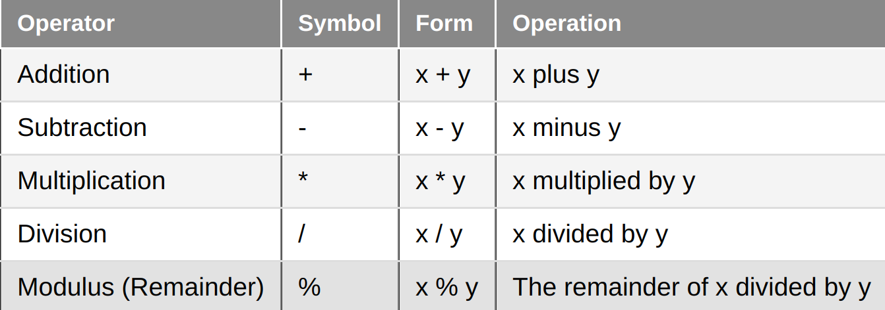
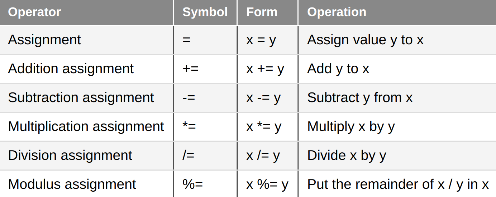

# [Chapter 5.1 - Operator Precedence and Associativity](https://www.learncpp.com/cpp-tutorial/operator-precedence-and-associativity/)
Operator **precedence** detemines the order in which operations are evaluated. 

For operators at the same precedence level, the operator's **associativity** determines whether to evaluate from left to right or right to left. 

You don't have to memorize the [precedence table](https://www.learncpp.com/cpp-tutorial/operator-precedence-and-associativity/), just refer to it when necessary:

**Best practice:** use parentheses to make reading complex expressions easier. For example, `(bool1 && bool2) || bool3`

# [Chapter 5.2 - Arithmetic Operators](https://www.learncpp.com/cpp-tutorial/operator-precedence-and-associativity/)

## Unary operators
Unary operators only take one operand. There are only two unary operators, **unary minus** and **unary plus** which return the operand multiplied by +/-1 appropriately.

## Binary operators


## Integer and floating point division
It's easiest to think of the division operator "/" as having two modes:

1. **Floating point division** where either or both of the operands are floating point values. (e.g. 7.0 / 4 = 1.75)
2. **Integer division** where both operands are integers. The fractional portion of the result is dropped (e.g. 7 / 4 = 1).

## Using static_cast<> to do floating point division with integers
Let's say we're dividing two ints, but we want to divide them without losing the fraction. We can do so by using `static_cast` to cast them to floating points and execute floating point division. For example:
```cpp
#include <iostream>

int main()
{
    int x{ 7 };
    int y{ 4 };

    std::cout << "int / int = " << x / y <<'\n';
    std::cout << "double / int = " << static_cast<double>(x) / y << '\n';
    std::cout << "int / double = " << x / static_cast<double>(y) << '\n';
    std::cout << "double / double = " << static_cast<double>(x) / static_cast<double>(y) << '\n';

    std::cout << "x is still an int: " << x << '\n';
    return 0;
}
```
## Arithmetic assignment operators

The above let you do things like reduce
```cpp
x = x + 4;
```
to
```cpp
x += 4;
```

# [5.3 - Modulus and Exponentiation](https://www.learncpp.com/cpp-tutorial/5-3-modulus-and-exponentiation/)
The **modulus operator** (a.k.a. the *remainder operator*) returns the remainder of a division operation. e.g. `7 % 4 = 3`

Modulus is most useful for checking if a number is divisible by another (i.e. has a remainder of zero).

## Modulus with Negative Numbers
The modulus returns results with the sign of x. 

```cpp
-6 % 4 = -2
6 % -4 = 2
```

## Where's the exponent operator?
There is no exponent operator in C++. The `^` character is the *Bitwise XOR* operator. 

To do exponentiation in C++, `#include <cmath>` and use the pow() function. Note that because of the use of floating point numbers, the results of pow() may not be precise (even when passing in integers).

If you want to do integer exponentiation, you're better off using your own function that uses `std::int_fast64_t` and the *exponentiation by squaring* algorithm for efficiency.

```cpp
#include <cstdint> // for std::int_fast64_t
 
// note: exp must be non-negative
std::int_fast64_t pow(int base, int exp)
{
    std::int_fast64_t result{ 1 };
    while (exp)
    {
        if (exp & 1)
            result *= base;
        exp >>= 1;
        base *= base;
    }
 
    return result;
}
```

> **Warning**: In the vast majority of cases, integer exponentiation will overflow the integral type, which is likely why such a function wasn't included in the standard library in the first place.

# [5.4 - Increment/decrement operators and side effects](https://www.learncpp.com/cpp-tutorial/increment-decrement-operators-and-side-effects/)

## Incrementing and Decrementing Variables
For each increment and decrement operation, there are two types of operators: prefix and postfix. They function slightly differently.

**Prefix** increment/decrement works as expected.
* Form: `++x` or `--x`
* Operation: increment/decrement x, then return x

**Postfix** increment/decrement 
* Form: `x++` or `x--`
* Operation: Copy x, then increment/decrement, then return x
* Notes: postfix has a lot more steps and is slightly less performant than the prefix version.

**Best practice:** strongly favor the prefix version of the increment and decrement operators as they are more performant and understandable.

## Side Effects
A function or expression is said to have a **side effect** if it does anything that persists beyond the life of the function or expression itself. In most cases, this is useful, but in the case of the increment/decrement operator, it can be confusing. For example,

```cpp
int add(int x, int y)
{
    return x + y;
}

int main()
{
    int x{ 5 };
    int value = add(x, ++x); // is this 5 + 6 or 6 + 6?

    std::cout << value;

    return 0;
}
```
C++ does not define the order in which function arguments are evaluated, so this is *compiler-dependent*. 

**Warning:** C++ does not define the order of evaluation for function arguments or operator operands.

**Warning:** don't use a variable that has a side effecto applied to it more than once in a given statement. If you do, the result may be undefined and/or compiler-dependent.

# [5.5 - Comma and Conditional Operators](https://www.learncpp.com/cpp-tutorial/comma-and-conditional-operators/)

## The comma operator
The **comma operator (,)** allows you to evaluate multiple expressions wherever a single expression is allowed. This is different from the comma symbol as a separator, as in the case of function parameters (e.g. `foo(int x, int y)`) which do not invoke the comma operator.

In the case of the comma operator, it will evaluate multiple expressions and return the right operand. For example,
```cpp
#include <iostream>

int main()
{
    int x{ 1 };
    int y{ 2 };

    std::cout << (++x, ++y);

    return 0;
}
```
Output:
```
3
```

Note that the comma operator has the lowest precedence of all the operators, even lower than the assignment operator `=`. In most cases, a statement using the comma operators would be better written as separate statements. 
```cpp
#include <iostream>

int main()
{
    int x{ 1 };
    int y{ 2 };

    ++x;
    std::cout << ++y;

    return 0;
}
```
The only exception where use of the comma operator may be common is within the *for loop*.

**Best practice:** avoid using the comma operator except within for loops. There is no need to avoid separator commas (except in the use of declaring multiple variables, which you should not do).

## The conditional operator
The **conditional operator (?:)** is a ternary operator (i.e. takes 3 operands). It lets us write if else statements in a more compact form: 

`(condition) ? expression1 : expression2`

If `condition` is true, then execute `expression1`, else execute `expression2`.

This lets us shorten this
```cpp
if (x > y)
    larger = x;
else
    larger = y;
```

into this
```cpp
larger = (x > y) ? x : y;
```

**Best practice:** parenthesize the conditional part of the conditional operator and consider parenthesizing the whole thing as well because the `?:` operator has a relatively low precedence.

Here is one situation where the conditional operator can exist in places where if/else cannot:

```cpp
#include <iostream>

int main()
{
    constexpr bool inBigClassroom { false };
    constexpr int classSize { inBigClassroom ? 30 : 20 };
    std::cout << "The class size is: " << classSize << '\n';

    return 0;
}
```

There's no satisfactory if/else statement for this. You could try:
```cpp
#include <iostream>

int main()
{
    constexpr bool inBigClassroom { false };
    if (inBigClassroom)
        constexpr int classSize { 30 };
    else
        constexpr int classSize { 20 };
    std::cout << "The class size is: " << classSize << '\n';

    return 0;
}
```
BUT you'll get an error saying `classSize` is undefined because its scope only lives within the if or else statement.

You could define it using another function, but that's a lot of work. The conditional operator is the most efficient way to do something like this.

**Note:** The type of the expressions in a conditional statement must either match, or the second expression must be convertible to the type of the first expression. For example, the following will give an error:
```cpp
std::cout << (x != 5 ? x : "x is 5"); // won't compile
```
The above won't compile because the second expression, `"x is 5"`, is a string literal which is not the same type as the int x. In this case, you have to use if/else.

**Best practice:** only use the conditional operator for simple conditionals where you use the result and where it enhances readability (e.g. a conditional initializer or assignment for a variable). Don't use it for complex if/else statements as it quickly becomes unreadable.

# [5.6 - Relational operators and floating point comparisons](https://www.learncpp.com/cpp-tutorial/relational-operators-and-floating-point-comparisons/)
The following operators are extremely straightforward to use when comparing integers:
```cpp
>
<
>=
<=
==
!=
```

## Boolean Conditional Values
By default, conditions in an if statement or conditional operator (and other places) evaluate as Boolean, so you DON'T need to do something like:
```cpp
if (b1 == true)
```
you can just write
```cpp
if(b1)
```
**Best practice:** don't add unnecessary == or != to conditions.

## Comparison of Floating Point Values
If a high level of precision is required, *comparing floating values using any of the relational operators can be dangerous*. This is because floating point values are not precise, and small rounding errors in the floating point operands may cause unexpected results. See [4.8 - Floating Point Numbers](https://www.learncpp.com/cpp-tutorial/floating-point-numbers/) for a refresher on this.

Comparisons are likely to go either way when the values are close (e.g. x > y when x = 0.00999999 and y = 0.0100000002) due to rounding errors. It's fine to use comparisons when the consequences of getting the comparison wrong are minimal, assuming the values are close.

## Floating Point Equality
**Warning:** because operands are almost never exactly equal, avoid using operator== and operator!= with floating point operands.

Instead, here are three approaches for comparing floating point numbers. The three approaches are successively better, and while there is no "one size fits all" approach for comparing floating point numbers, the third approach, `approximatelyEqualAbsRel()` will cover most cases.

The first approach is the naive approach.
```cpp
#include <cmath> // for std::abs()

bool isAlmostEqual(double a, double b, double epsilon)
{
    return std::abs(a - b) <= epsilon;
}
```
Above, we simply check that the magnitude difference between the two numbers is <= epsilon. However, this logic doesn't transfer too well across a wide variety of magnitudes. For example, `epsilon = 0.000001` may work for comparing numbers around 0, but may be too large for numbers around 100,000, and would be too large for numbers around 1e-9. Instead, a relative approach is better.

```cpp
bool approximatelyEqualRel(double a, double b, double epsilon)
{
    return (std::abs(a - b) <= std::max(std::abs(a), std::abs(b)) * epsilon);
}
```
But even the relative approach breaks down around zero. For example, in the case below near zero, we'd expect approximatelyEqualRel() to output true, but it outputs false.
```cpp
double a = 0.1 + 0.1 + 0.1 + 0.1 + 0.1 + 0.1 + 0.1 + 0.1 + 0.1 + 0.1;
std::cout << approximatelyEqualRel(a - 1.0, 0.0, 1e-8) << '\n';
```
That's because relative to a, the threshold for error is really small. We can fix this by first checking an absolute epsilon to cover the near zero case, then a relative epsilon to cover other cases. The absEpsilon error should be set to something very small (eg. 1e-12) to cover only near zero cases.
```cpp
bool approximatelyEqualAbsRel(double a, double b, double absEpsilon, double relEpsilon)
{
    double diff{ std::abs(a - b) };
    // if the numbers are really close in the absolute sense, return true
    if (diff <= absEpsilon)
        return true;
    // otherwise, check the relative proximity using Knuth's algorithm
    return (std::abs(a - b) <= std::max(std::abs(a), std::abs(b)) * relEpsilon);
}
```

# [5.7 - Logical Operators](https://www.learncpp.com/cpp-tutorial/logical-operators/)
C++ has three logical operators:
1. Logical NOT: `!`
2. Logical AND: `&&`
3. Logical OR: `||`

## Logical NOT

Note that logical NOT has a very high level of precedence. For example, 
```cpp
if (!x > y)
```
is not the same as 
```cpp
if (!(x > y))
```

**Best practice:** If logical NOT is intended to operator on the result of other operands, the other operators and their operands need to be enclosed in parentheses (e.g. `if (!(x > y)))`.

## Logical OR
This operates as expected. 

Note that you can string together multiple logical OR statements (e.g. `if (value == 0 || value == 1 || value == 2`).

Note that this is not the same as the *bitwise OR* operator (`|`)

## Logical AND
This operates as expected, and you can string together multiple logical AND statements (e.g. `if (value > 10 && value < 20 && value != 16)`)

## Short Circuit Evaluation
In the case of a logical AND string, if one operand evaluates to false, the operator will return false immediately.

In the case of a logical OR string, if one operand evaluates to true, the operator will return true immediately.

This is known as **short circuit evaluation**, and it's done for evaluation purposes. It may cut short the evaluation of multiple operands in a logical AND or logical OR string, so be wary of operands with side effects (e.g. counting on an operand like `++y` to increment the variable).

**Warning:** Short circuite evaluation may cause logical OR and logical AND statements to not evaluate one operand. Avoid using expressions with side effects in conjunction with these operands.

## Mixing ANDs and ORs
**Best practice:** When mixing *logical AND* and *logical OR* in a single expression, explicitly parenthesize each operation to ensure they evaluate how you intend.

**Note:** *logical AND* has a higher precedence than *logical OR*, so a statement like `value1 || value2 && value3` will evaluate as `value1 || (value2 && value3)`. To avoid confusion, parenthesize each operation.

## Where's the logical exclusive or (XOR) operator?
C++ does not have a *logical XOR* operator (either or but not both).

However, you can mimic it with the `!=` and boolean operands:
```cpp
if (a != b)... // a XOR b, assuming a and b are Booleans
...
if (a != b != c != d)... // a XOR b XOR c XOR d, assuming all operands are Booleans
```

If the operands are non-Boolean, you can static_cast them to bool:
```cpp
if (static_cast<bool>(a) != static_cast<bool>(b))
```

# [5.x - Chapter 5 Summary and Quiz](https://www.learncpp.com/cpp-tutorial/chapter-5-summary-and-quiz/)
