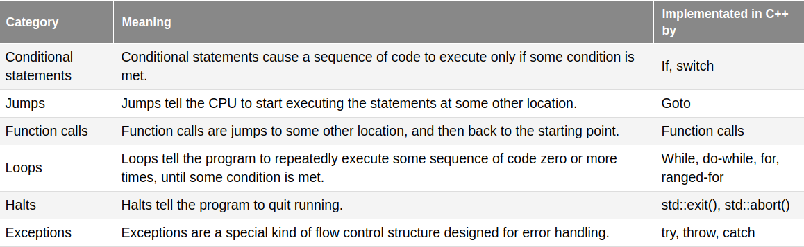

# [7.1 - Control Flow Introduction](https://www.learncpp.com/cpp-tutorial/control-flow-introduction/)
We can control the execution path of a program.

**Straight-line programs** run in a straight line from the top of main to the end.

**control flow statements** (a.k.a. flow control statements) allow programmers to change the normal path of execution through the program. Changing the point of execution to a non-sequential statement is called **branching**.

## Categories of Flow Control Statements


# [7.2 - If statements and blocks](https://www.learncpp.com/cpp-tutorial/if-statements-and-blocks/)
**Best practice:** consider using {} for `if` or `else` blocks even if there is only a single statement.

Note that even if you don't include blocks{} for single statements, they will be implicitly placed. That means something like
```cpp
#include <iostream>
 
int main()
{
    if (true)
        int x{ 5 };
    else
        int x{ 6 };
 
    std::cout << x;
 
    return 0;
}
```
will not work because x is destroyed after the if/else block.

# [7.3 - Common if statement problems](https://www.learncpp.com/cpp-tutorial/common-if-statement-problems/)
## Nested if statements and the dangling else problem
`else` statements are paired with the last unmatched `if` statement in the same block. Use blocks{} to avoid ambiguity and make this easy to read.

## Flattening nested if statements
Nested if statements can often be flattened by restructuring the logic, using `else if`, and using logical operators (covered in 5.7).

## Null statements
A **null statement** is a statement that just consists of a semicolon. 
```cpp
if (x > 10)
    ;
```
**Warning:** be careful not to accidentally terminate your if statement with a semicolon:
```cpp
if (nuclearCodesActivated());
    blowUpTheWorld();
```
is read by the compiler as
```cpp
if (nuclearCodesActivated())
    ;
blowUpTheWorld();
```

## Operator== vs Operator= inside the conditional
Be careful not to accidentally use `=` instead of `==` inside the conditional. For example:
```cpp
if (x == 0) // right
if (x = 0)  // wrong
```

# [7.4 - Switch statement basics](https://www.learncpp.com/cpp-tutorial/switch-statement-basics/)
A **switch statement** evaluates an expression (the condition) to produce a value. If the expression's value is equal to any of the `case labels`, then the statements after the matching `case label` are executed. If no matching `case label` exists but a `default` exists, then those statements are run.

*The condition must evaluate to an integral type!*

The default label is optional, and like other `case label`s there can only be one per switch. **Best practice:** place the default case last in the switch block.

Instead of using `return` to exit the switch (which also exits your function) you can use the `break` keyword.

For a simple example of switch statements, see [main.cpp](../7-projects/7-4/main.cpp)

# [7.5 - Switch fallthrough and scoping](https://www.learncpp.com/cpp-tutorial/switch-fallthrough-and-scoping/)
## Fallthrough
If you don't include a `break` or `return` statement to redirect the execution flow after matching a `case label`, then the following statements under all subsequent `case label`s will also execute. This is called **fallthrough**.

## The [[fallthrough]] attribute
If fallthrough is intentional, you can comment that in the code. However, the compiler will often warn of fallthrough. 

If you intend to have the execution flow fallthrough after a executing the statements under a case label, you can use the ``[[fallthrough]]`` attribute in C++17 to suppress compiler warnings. For example,
```cpp
#include <iostream>

int main()
{
    switch(2)
    {
        case 1:
            std::cout << 1 << '\n';
            break;
        case 2:
            std::cout << 2 << '\n';
            [[fallthrough]];
        case 3:
            std::cout << 3 << '\n';
            break;
    }
    return 0;
}
```

## Sequential case labels
We can stack case labels to write a statement with logical OR operands more efficiently. For example, we can write
```cpp
bool isVowel(char c)
{
    return (c=='a' || c=='e' || c=='i' || c=='o' || c=='u' ||
        c=='A' || c=='E' || c=='I' || c=='O' || c=='U');
}
```
more efficiently as
```cpp
bool isVowel(char c)
{
    switch(c)
    {
        case 'a':
        case 'e':
        case 'i': // or if c is 'i'
        case 'o': // or if c is 'o'
        case 'u': // or if c is 'u'
        case 'A': // or if c is 'A'
        case 'E': // or if c is 'E'
        case 'I': // or if c is 'I'
        case 'O': // or if c is 'O'
        case 'U': // or if c is 'U'
            return true;
        default:
            return false;
    }
}
```

This is NOT considered fallthrough behavior. This is more efficient than many `||` operators because we only evaluate `c` once.

## Switch case scoping
There is NO implicit block created after the case label. All statements are considered part of the switch block.

Note that the switch statement controls the *flow* of execution essentially by identifying the correct point of entry into the block. Once it enters, it will execute the contents of the block linearly until a `return` or `break` cause it to exit.

## Variable declaration and initialization inside case statements
You can declare (*but not initialize*) variables inside the switch, both before and after the case labels. 

**Rule:** if defining variables used in a case statement, do so in a block inside the case (or before the switch if appropriate).

For example,
```cpp
switch(1)
{
    int a; // okay: declaration is allowed
    int b{ 5 }; // ERROR initialization NOT allowed

    case 1:
        int y; // okay but bad practice
        y = 4;
        break;
    case 2:
        y = 5; // okay: y was declared above so it is in scope
        break;
    case 3:
        int z{ 4 }; // ERROR: initialization is NOT allowed
        break;
    case 4:
    {
        int x{ 4 };
        std::cout << x;
        break;
    }
    default:
        std::cout << "default case\n";
        break;
}
```

For an example of a switch statement in action, see [main.cpp](../7-projects/7-5/main.cpp)

# [7.6 - Goto statements](https://www.learncpp.com/cpp-tutorial/goto-statements/)
An **unconditional jump** causes execution to jump to another spot in the code. They are implemented via a **goto statement**, and the spot to jump to is identified through the use of a **statement label**. In the following example, we use it to keep requesting input from the user until we get valid input:
```cpp
#include <iostream>
#include <cmath>

int main()
{
    double x{};
tryAgain:   // this is a statement label
    std::cout << "Enter a non-negative number: ";
    std::cin >> x;

    if (x < 0.0)
        goto tryAgain; // this is a goto statement

    ... // more code here
}
```

## Statement labels have function scope
Statement labels have **function scope**, meaning they are visible throughout the function. The `goto` statement and its corresponding statement label must appear inside the same function.

You can only jump forward/backward *within* a single function (you can't jump from one function to another) and if you jump forwards, you can't jump forward over the initialization of any variable that is still in scope at the location being jumped to.

You can, however, jump backwards over a variable initialization and the variable will be re-initializzed when the initialization is executed.

## Avoid using goto
**Best practice:** avoid `goto` statements unless the alternatives are significantly worse for code readability.

# [7.7 - Intro to loops and while statements](https://www.learncpp.com/cpp-tutorial/intro-to-loops-and-while-statements/)
An example of while loop syntax:
```cpp
#include <iostream>

int main()
{
    int count{ 1 };
    while (count <= 100)
    {
        std::cout << count << ' ';
        ++count;
    }

    std::cout << "done!";

    return 0;
}
```

Note that if the while condition initially evaluates to false, the while loop's statements are not executed!

If it's always true, you get an **infinite loop**. You can have an intentional while loop:
```cpp
#include <iostream>

int main()
{
    while (true)
    {
        // do something, maybe service web requests
    }
}
```
**Best practice:** favor `while (true)` for intentional infinite loops.

## Loop variables
**Loop variables** may be used to execute a loop a certain number of times. Consider naming them something more unique and searchable like `iii` or `jjj`, or a real word such as `count`.

## Loop variables should be signed
**Best practice:** loop variables should be of type (signed) int

## Doing something every N iterations
Use the modulus operator on the counter to do something every Nth iteration (e.g. print a new line).

## Nested loops
You can do them.

For some good examples of while loops, see:
- [quiz 2 answer](../7-projects/7-7-quiz-2/main.cpp)
- [quiz 3 answer](../7-projects/7-7-quiz-3/main.cpp)
- [quiz 4 answer](../7-projects/7-7-quiz-4/main.cpp)

# [7.8 - Do while statements](https://www.learncpp.com/cpp-tutorial/do-while-statements/)
A **do while statement** is a looping construct that works just like a while loop, except that the statement always executes at least once. Afte the statement has been executed, the do-while loop checks the condition. If it's true, the path of execution jumps back to the top to `do` and executes again.

**Best practice:** favor while loops over do-while loops when given an equal choice.

For an example of a do-while loop, see [main.cpp](../7-projects/7-8/main.cpp)

# [For statements](https://www.learncpp.com/cpp-tutorial/for-statements/)
The easiest way to understand what a `for` loop does is by converting it to an equivalent `while` loop.
for loop:
```cpp
for (init-statement; condition; end-expression)
    statement
```
is equivalent to:
```cpp
{
    init-statement; // used to define variables used in the loop
    while (condition)
    {
        statement;
        end-expression; // modify the loop variable prior to reassesment of the condition
    }
}   // variables defined in init-statement go out of scope here
```

## Evaluation of for statements
See the above while loop equivalent for a breakdown of what the for loop does and how it does it efficiently. Here is a syntactical example of a for loop:
```cpp
#include <iostream>

int main()
{
    for (int count{ 1 }; count <= 10; ++count)
    {
        std::cout << count << ' ';
    }
    return 0;
}
```

We can also decrement the loop variable by 1:
```cpp
#include <iostream>

int main()
{
    for (int count{ 9 }; count >= 0; --count)
        std::cout << count << ' ';
    
    return 0;
}
```

or change the loop variable by more than 1 each iteration
```cpp
#include <iostream>

int main()
{
    for (int count{ 9 }; count >= 0; count -= 2)
        std::cout << count << ' ';
    
    return 0;
}
```

**Warning:** watch out for "off-by-one errors" where your counting starts or ends off-by-one.

## Ommitted expressions
You can omit expressions within the for loop, but is UNADVISABLE. Don't do it.

## For loops with multiple counters
If your for loop needs to work with multiple variables, you can define them and manipulate them as such:
```cpp
#include <iostream>

int main()
{
    for (int x{ 0 }, y{ 9 }; x < 10; ++x, --y)
        std::cout << x << ' ' << y << '\n';
    return 0;
}
```

**Best practice:** definining multipe variables (in the init-statement) and using the comma operator (in the end-expression) is acceptable inside a for statement.

## Nested for loops
You can do nested for loops.

## Conclusion
**Best practice:**
- prefer for loops over while loops when there is an obvious loop variable
- prefer while loops over for loops when there is no obvious loop variable

# [7.10 - Break and continue](https://www.learncpp.com/cpp-tutorial/break-and-continue/)
The **break statement** causes a while loop, do-while loop, for loop, or switch statement to end, with execution continuing with the next statement after the loop or switch being broken out of.

## Continue

The **continue statement** provides a convenient way to end the current iteration of the loop without terminating the entire loop. They cause the current point of execution to jump to the bottom of the current loop. If it's a for loop, the end-statement still executes (e.g. the increment) since it happens after the end of the loop body.

Be careful using `continue` inside a while or do-while loop. These loops typically change the value of the counter inside the loop body, and continue could skip that and turn this into an infinite loop.

**Best practice:** use break, continue, and early returns when they simplify your loop logic.

# [7.11 - Halts (exiting your program early)](https://www.learncpp.com/cpp-tutorial/halts-exiting-your-program-early/)
A **halt** is a flow control statement that terminates the program. IN C++, halts are implemented as functions, so our halt statements will be one of the following function calls:
- `std::exit()`
- `std::quick_exit()` for multi-threaded programs
- `std::abort()`
- `std::terminate()`

**Best practice:** only use a halt if there is no safe way to return normally from the main function. If you haven't disabled exceptions, prefer using exceptions for handling errors safely.

With that summary, here are some details:

## The std::exit() function
`std::exit()` is a function that causes the program to terminate normally. **Normal termination** means the program has exited in an expected way. Normal termination does not imply anything about whether the program was successful (that's what the status code is for).

`std::exit()` performs a number of cleanup functions. First, it destroys objects with static storage duration. Then it does some other misc stuff. Finally it returns control back to the OS with the argument passed to `std::exit()` as used as the status code.

You can call `std::exit()` explicitly to exit a program (e.g. main), but note that *std::exit does not clean up local variables in the current function or up the call stack!!!*

## std::atexit

You can register functions that will automatically be called on program termination via `std::exit()`. A few things to note:
1. functions registered with `std::atexit()` will be called when the program exits via `std::exit`, even implicitly
2. the function registered must take no parameters and have no return value
3. you can register multiple cleanup functions and they will be called inreverse order of registration (last called first)

**Note:** for multi-threaded programs, call `std::quick_exit()` and `std::at_quick_exit()` instead.

## std::abort and std::terminate
`std::abort()` causes your program to terminate abnormally. **Abnormal termination** means the program had some kind of unusual runtime error and couldn't continue to run. `std::abort` is called implicitly with asert and static_assert.

`std::terminate` is typically used in conjunction with exceptions. Althought it can be called explicitly, it is more often called implicitly when an exception isn't handled (and in other cases). By default, `std::terminate()` calls `std::abort()`.

# [7.12 - Introduction to testing your code](https://www.learncpp.com/cpp-tutorial/introduction-to-testing-your-code/)
